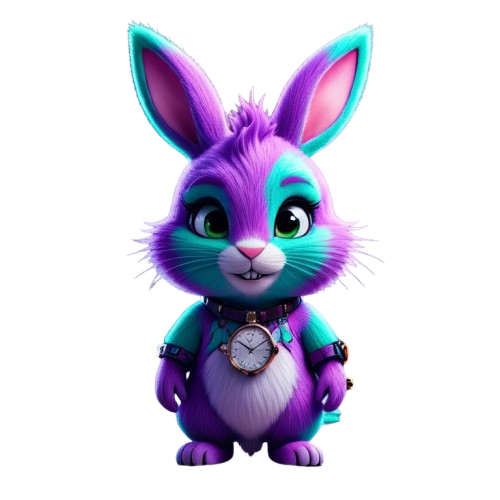
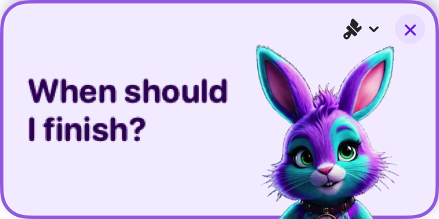
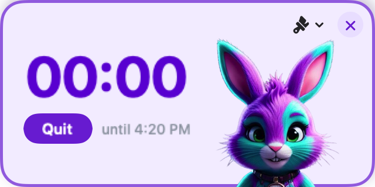
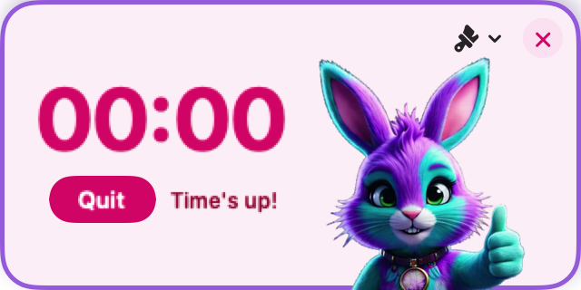

<p align="center"></p>

# Saz-Bunny Countdown Timer

Hi, I'm Saz-Bunny. I'm here to help you focus, with a minimal but pretty floating countdown timer for macOS.

Tell me when your focus session finishes and I'll show you a timer which stays on screen until time's up. No dock icon, no menu bar — just a small always-on-top widget.

# Usage
1. Open me up
2. Speak the time you want me to count down to — "five twenty", "3:45 PM", "nine o'clock", whatever feels natural.
   - On the first run you'll need to grand permissions
3. Crack on with your session!
4. When time's up, I'll make a a gentle chime and change the digits change color.
5. Hit **Quit** or the **X** button to dismiss.





Don't feel like talking? You can also set a time from the terminal:

```bash
open countdown://4:20
open countdown://16:30
```

# Privacy
Speech recognition runs entirely on-device. The app doesn't track anaything or need any kind of Internet connection.
 
# Installation

At the moment you need to build the app yourself, soon I'll sort our releases.

Requires macOS 13+. Build from source with Xcode 15+:

```bash
xcodebuild -scheme CountdownTimer -destination 'platform=macOS' SYMROOT=build
open build/Debug/CountdownTimer.app
```

Or just open `CountdownTimer.xcodeproj` in Xcode and hit Cmd+R.

### Time formats

The parser is pretty flexible — `4:20 PM`, `16:20`, `520`, `4 PM`, or just `4` all work. When a time is ambiguous (no AM/PM), it picks whichever is closest in the future. If you set something between 10 PM and 9 AM, it'll double-check with you first.

## Running tests

```bash
xcodebuild test -scheme CountdownTimer -destination 'platform=macOS'
```

Covers time parsing, speech extraction, URL scheme handling, focus state, and snapshot tests (via [swift-snapshot-testing](https://github.com/pointfreeco/swift-snapshot-testing)). Snapshot tests record reference images on first run — if you change the UI, delete `CountdownTimerTests/__Snapshots__/` and run tests twice.

## License

Personal use, commercial use. Do what you want with it. I'd love to hear from you if you do.

No warranty, it's vibe-coded. :)
