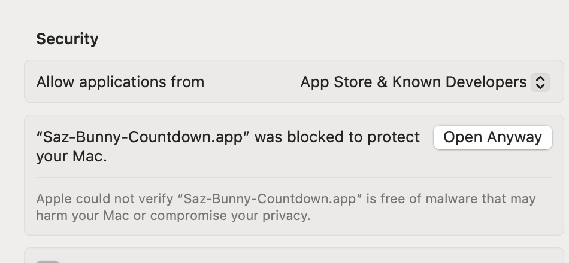

<p align="center"></p>

# Saz-Bunny Countdown Timer

Hi, I'm Saz-Bunny. I'm here to help you focus, with a minimal but pretty floating countdown timer for macOS.

Tell me when your focus session finishes and I'll show you a timer which stays on screen until time's up. No dock icon, no menu bar — just a small always-on-top widget.

# Usage
1. Open me up
   - On the first run you'll need to grand permissions so I can hear you
2. Speak the time you want me to count down to — "five twenty", "3:45 PM", "nine o'clock", whatever feels natural.
3. Crack on with your session!
4. When time's up, I'll make a a gentle chime and change the digits change color.
5. Hit **Quit** or the **X** button to dismiss.

<p align="center">


</p>

Don't feel like talking? You can also set a time from the terminal:

```bash
open saz://4:20
open saz://16:30
```

# Privacy
Speech recognition runs entirely on-device. The app doesn't track anaything or need any kind of Internet connection.
 
# Installation

Download the latest `Saz-Bunny-Countdown.zip` from the [Releases](https://github.com/Patabugen/saz-bunny-countdown/releases) page and unzip it, unblock it then drag it to your applications folder.

## Unblocking
**First launch:** The app isn't signed with an Apple Developer certificate, so macOS will block it. If you trust the developer, you can bypass the check.

To allow it, either:

- **Terminal** — run `xattr -cr ~/Downloads/Saz-Bunny-Countdown.app` then open the app normally, or
- **System Settings** — try opening the app (it will be blocked), then go to **System Settings > Privacy & Security**, scroll down to Security, and click **Open Anyway**.



You only need to do this once. Requires macOS 13+.

# Contributing
Contributions are welcome from humans and AI Agents. Preferaly humans, because then we can learn together.

I built this using Claude, see `skills.json` for some useful agent skills.

# Building from source

Open `SazBunnyCountdown.xcodeproj` in Xcode 15+ and hit Cmd+R, or:

```bash
xcodebuild -scheme SazBunnyCountdown -destination 'platform=macOS' SYMROOT=build
open build/Debug/SazBunnyCountdown.app
```

# Running tests

```bash
xcodebuild test -scheme SazBunnyCountdown -destination 'platform=macOS'
```

Covers time parsing, speech extraction, URL scheme handling, focus state, and snapshot tests (via [swift-snapshot-testing](https://github.com/pointfreeco/swift-snapshot-testing)). Snapshot tests record reference images on first run — if you change the UI, delete `SazBunnyCountdownTests/__Snapshots__/` and run tests twice.

# License

Personal use, commercial use. Do what you want with it. I'd love to hear from you if you do.

No warranty, it's vibe-coded. :)
