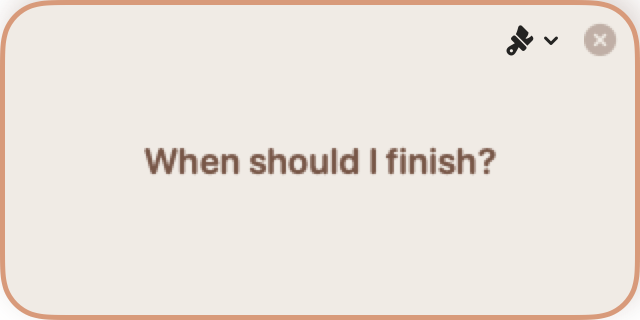
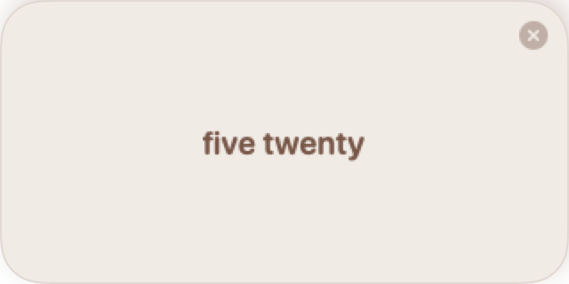
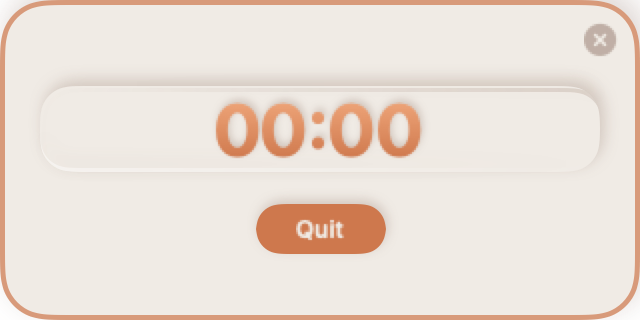
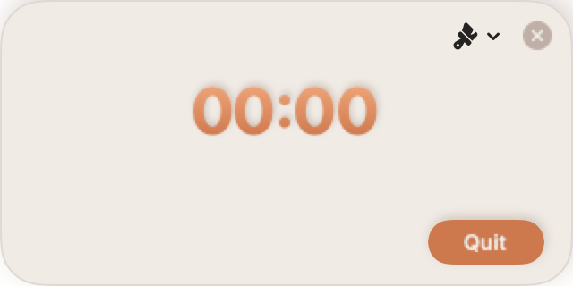

<p align="center"></p>

# Saz-Bunny Countdown Timer

A minimal but pretty floating countdown timer for macOS. Tell it when you need to finish, and it stays on screen until time's up. No dock icon, no menu bar — just a small always-on-top widget.

## Getting started

Requires macOS 13+. Build from source with Xcode 15+:

```bash
xcodebuild -scheme CountdownTimer -destination 'platform=macOS' SYMROOT=build
open build/Debug/CountdownTimer.app
```

Or just open `CountdownTimer.xcodeproj` in Xcode and hit Cmd+R.

### 1. Tell it when to finish

Launch the app and it asks you one thing:

<p align="center"></p>

Just say a time out loud — "five twenty", "3:45 PM", "nine o'clock", whatever feels natural. Speech recognition runs entirely on-device.

<p align="center"></p>

Don't feel like talking? You can also set a time from the terminal:

```bash
open countdown://4:20
open countdown://16:30
```

Or trigger it through Siri / Shortcuts if you can figure out how to get that working (Claude couldn't).

### 2. Wait

The widget counts down in the corner of your screen. Click it to focus, click away to let it fade into the background.

<p align="center">
&nbsp;&nbsp;

</p>

When time's up, you'll hear a gentle chime and the digits change color. Hit **Quit** or the **X** button to dismiss.

### Time formats

The parser is pretty flexible — `4:20 PM`, `16:20`, `520`, `4 PM`, or just `4` all work. When a time is ambiguous (no AM/PM), it picks whichever is closest in the future. If you set something between 10 PM and 9 AM, it'll double-check with you first.

## Running tests

```bash
xcodebuild test -scheme CountdownTimer -destination 'platform=macOS'
```

Covers time parsing, speech extraction, URL scheme handling, focus state, and snapshot tests (via [swift-snapshot-testing](https://github.com/pointfreeco/swift-snapshot-testing)). Snapshot tests record reference images on first run — if you change the UI, delete `CountdownTimerTests/__Snapshots__/` and run tests twice.

## License

Personal use, commercial use. Do what you want with it. I'd love to hear from you if you do.

No warranty, it's vibe-coded. :)